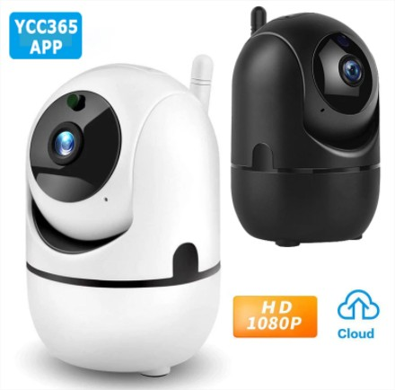
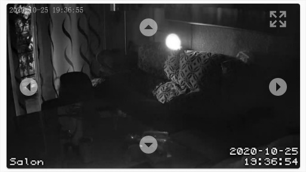

# PTZ-YCC365

Este componente personalizado permite utilizar las funciones de Pan y Tilt de cámaras chinas que no cumplen completamente el protocolo ONVIF.

Por algún motivo, la integración ONVIF de Home Assistant no funciona con mis cámaras que utilizan la aplicación YCC365 Plus para su configuración.

He utilizado la aplicación ONVIF Device Manager y desde esta aplicación de PC puedo utilizar las funciones pan y tilt.

Al parecer, estas cámaras no cumplen completamente el protocolo ONVIF y la integración de Home Assistant de momento no puede integrarlas.

He buscado una solución para poder utilizar en Home Assistant con la opcion pan y tilt.

Utilizando la aplicación Wireshark he podido obtener información para utilizar estas cámaras.

Para poder utlizar este compoente personalizado, recomiendo que integres la señal de tus camaras con motionEye. **Este componente no integra la señal de vídeo de sus cámaras, solo la función de pan y til.**

### Cámaras testadas

  - [YCC365 Plus IP Cámara 1080P 360°](https://es.aliexpress.com/item/4000055767917.html)
  

  
      - rtsp://IP:554	1280x720 h264	no audio
      - rtsp://IP:554/0/av0	1280x720 h264	audio mono 8000Hz 16 bits
      - rtsp://IP:554/0/av1	640x352 h264	audio mono 8000Hz 16 bits

## Instalación
Solo necesita instalar el componente personalizado de forma habitual. Copia la carpeta otz_camera de este proyecto en su directorio /config/custom_components/ de su Home Assistant.

## Configuración
En su configuration.yaml:

```yaml
ptz_camera:
```
## Servicios
Este componente personalizado crea varios servicios con dominio ptz_camera. Para obtener información sobre estos servicios puede utilizar “Herramientas para desarrolladores” > Servicios. Tendrá información detallada sobre los argumentos para llamar a cada servicio.

## Entidad Cámara

Puedes crear una cámara de la manera habitual. Yo te recomiendo usar el addon [motionEye](https://addons.community/) y crear una cámara mjpeg. Es la mejor configuración que he encontrado con un delay bajo. Un ejemplo de configuración seria:

```yaml
camera:
  - platform: mjpeg
    name: Salón
    mjpeg_url: http://192.168.1.111:8083
```

## Tarjeta con controles
Una forma fácil de utilizar los controles de pan y tilt es supermoner unos controles sobre la imagen de una cámara.

```yaml
type: picture-elements
camera_view: live
camera_image: camera.salon
elements:
  - type: icon
    icon: 'mdi:arrow-left-drop-circle'
    tap_action:
      action: call-service
      service: ptz_camera.move_left
      service_data:
        hots: 192.168.1.244
    style:
      bottom: 45%
      left: 5%
      color: white
      opacity: 0.5
      transform: 'scale(1.5, 1.5)'
  - type: icon
    icon: 'mdi:arrow-right-drop-circle'
    tap_action:
      action: call-service
      service: ptz_camera.move_rigth
      service_data:
        hots: 192.168.1.244
    style:
      bottom: 45%
      right: 5%
      color: white
      opacity: 0.5
      transform: 'scale(1.5, 1.5)'
  - type: icon
    icon: 'mdi:arrow-up-drop-circle'
    tap_action:
      action: call-service
      service: ptz_camera.move_up
      service_data:
        hots: 192.168.1.244
    style:
      top: 10%
      left: 46%
      color: white
      opacity: 0.5
      transform: 'scale(1.5, 1.5)'
  - type: icon
    icon: 'mdi:arrow-down-drop-circle'
    tap_action:
      action: call-service
      service: ptz_camera.move_down
      service_data:
        hots: 192.168.1.244
    style:
      bottom: 10%
      left: 46%
      color: white
      opacity: 0.5
      transform: 'scale(1.5, 1.5)'
  - type: icon
    icon: 'mdi:arrow-expand-all'
    tap_action:
      action: more-info
    entity: camera.salon
    style:
      top: 5%
      right: 5%
      color: white
      opacity: 0.5
      transform: 'scale(1.5, 1.5)'
```
      

